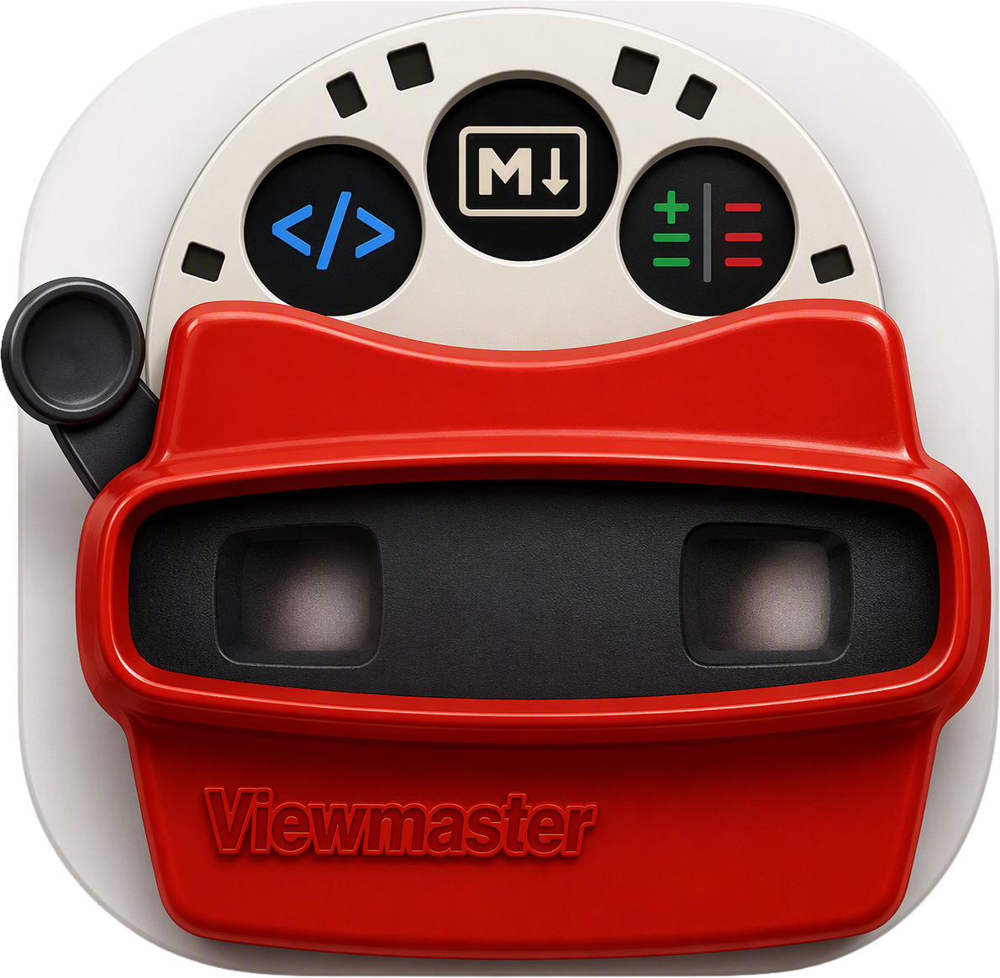

<p align="center">
  
</p>

A read-only desktop viewer for **markdown documents** and **branch diffs**.

Built to replace reaching for a full IDE just to read a rendered markdown file or
eyeball what changed on a branch. View Master does two things, and only ever
*views* — it never edits your files.

## Features

### Markdown viewing
- Renders markdown beautifully — no raw source.
- Renders embedded **mermaid** diagrams.
- Syntax-highlighted code fences.
- Hyperlinks open in your **default browser**.

### Branch diff viewing
- Left sidebar shows **only the files changed within the current branch** —
  committed, staged, or modified/untracked — collapsed to just the directories
  that contain changes.
- **Changed / Browse toggle** — flip to Browse to see the full folder tree
  (filtered by `.gitignore`), not just what changed. Files that are still
  git-changed keep their status coloring. Opening a folder that isn't a git
  repository always browses — there's nothing "changed" to show without git.
- File-type icons and status coloring (untracked / modified / staged / committed).
- Click a **markdown** file → rendered view, with a three-way toggle:
  **Rendered | Marks | Source**.
- **Editor's-marks diff (Marks)** — the branch's changes shown as proofreader's
  marks inline in the *rendered* output: insertions highlighted, deletions
  struck through. Changed code fences and mermaid diagrams appear as the old
  block (struck) followed by the new block.
- Click **any other file** → read-only, syntax-highlighted code with line numbers
  (VS Code's Monaco editor), with a **Diff toggle**.
- Diffs are **side-by-side** by default, with an inline toggle.
- **Right-click a file → Copy absolute path** (handy for pasting into AI chats).
- The change list and open file **auto-refresh** as files change on disk.

The "changed in this branch" baseline is the branch's fork point
(`git merge-base HEAD <default-branch>`), so you see everything the branch
introduced — not just what happens to differ from the tip of `main`.

## Tech stack

Electron + TypeScript + React, with Monaco (code + diffs), markdown-it + mermaid +
shiki (rendered markdown), and Allotment (resizable panes). Dark mode only.

## Development

> Prerequisites: Node.js and the `git` CLI on your `PATH`.

```bash
npm install
npm run dev      # launch the app with hot reload
npm test         # run the test suite (vitest)
```

## Building

```bash
npm run build          # compile
npm run dist:mac       # build a macOS .dmg
npm run dist:linux     # build a Linux AppImage
npm run dist:win       # build a Windows .exe
```

### Running an unsigned macOS build

The DMG is currently **unsigned** (no signing keys yet), so macOS Gatekeeper will
refuse to open it on first launch. To run it:

1. Move `View Master.app` to `/Applications` (optional).
2. **Right-click the app → Open**, then confirm in the dialog.

This is a one-time step per machine. Signing and notarization are on the roadmap.

## Roadmap

- Side-by-side rendered old-vs-new markdown as an alternate diff mode.
- Code signing + notarization for Gatekeeper-clean, distributable DMGs.
- Search / filter within the changed-file list.
- Configurable baseline (compare against an arbitrary branch or ref).

## Status

MVP in development. See
[`docs/superpowers/specs/2026-07-08-viewmaster-design.md`](docs/superpowers/specs/2026-07-08-viewmaster-design.md)
for the full design.
