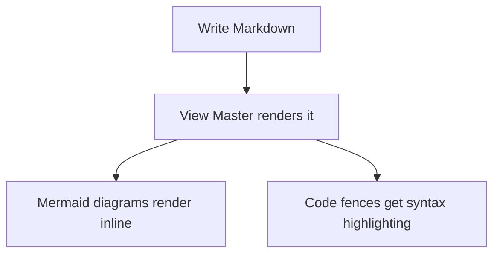

# View Master Website Implementation Plan

> **For agentic workers:** REQUIRED SUB-SKILL: Use superpowers:subagent-driven-development (recommended) or superpowers:executing-plans to implement this plan task-by-task. Steps use checkbox (`- [ ]`) syntax for tracking.

**Goal:** Build a single static dark-themed marketing page for View Master (`website/`), with real screenshots of the app, deployed to GitHub Pages via GitHub Actions.

**Architecture:** Plain HTML + CSS, no framework, no build step, no JavaScript. A GitHub Actions workflow publishes the `website/` folder to GitHub Pages on every push to `master` that touches it.

**Tech Stack:** HTML5, CSS (custom properties, no preprocessor), GitHub Actions (`actions/upload-pages-artifact`, `actions/deploy-pages`). Screenshots captured live via the `run-viewmaster` skill's Playwright-driven Electron REPL.

**Spec:** `docs/superpowers/specs/2026-08-28-website-design.md`

## Global Constraints

- Single page only — no multi-page navigation, no JS-driven interactivity, no backend.
- Dark theme only (matches the app itself).
- No download/build-install links — no GitHub Releases exist yet; the CTA is "View on GitHub" linking to `https://github.com/brucevanhorn2/viewmaster`.
- No automated tests — this is static markup with no logic; verification is file-existence/well-formedness checks and (for you, after merge) opening the deployed page.
- All asset paths referenced by `website/index.html` and `website/styles.css` must resolve to files *inside* `website/` — the GitHub Pages deploy workflow uploads only that folder, so anything outside it (e.g. `img/viewmaster.png`) is invisible to the deployed site unless copied in.

---

### Task 1: Website skeleton, logo, and favicon

**Files:**
- Create: `website/screenshots/` (empty directory, populated in Task 2)
- Create: `website/logo.png` (copy of `img/viewmaster.png`, used full-size in the hero)
- Create: `website/favicon.png` (64×64 resize of `img/viewmaster.png`, used as the tab icon)

**Interfaces:**
- Produces: `website/logo.png` and `website/favicon.png`, referenced by ``/`<link>` tags in Task 3's `website/index.html`.

- [ ] **Step 1: Create the directory skeleton and copy the logo**

```bash
mkdir -p website/screenshots
cp img/viewmaster.png website/logo.png
```

- [ ] **Step 2: Generate the favicon**

`img/viewmaster.png` is 1190×1165 and ~2MB — too large for a favicon, which loads on every page visit. Resize it down using Python's Pillow (already available in this environment):

```bash
python3 -c "
from PIL import Image
im = Image.open('img/viewmaster.png').convert('RGBA')
im.resize((64, 64), Image.LANCZOS).save('website/favicon.png')
"
```

- [ ] **Step 3: Verify both files exist and are valid images**

```bash
python3 -c "
from PIL import Image
logo = Image.open('website/logo.png')
favicon = Image.open('website/favicon.png')
assert logo.size == (1190, 1165), logo.size
assert favicon.size == (64, 64), favicon.size
print('OK', logo.size, favicon.size)
"
```

Expected output: `OK (1190, 1165) (64, 64)`

- [ ] **Step 4: Commit**

```bash
touch website/screenshots/.gitkeep
git add website/logo.png website/favicon.png website/screenshots/.gitkeep
git commit -m "feat: add website skeleton, logo, and favicon"
```

(`website/screenshots/` is empty until Task 2 — the `.gitkeep` keeps the directory tracked in the meantime; Task 2 removes it once real screenshots land there.)

---

### Task 2: Capture real app screenshots

**Files:**
- Create: `website/screenshots/markdown-mermaid.png`
- Create: `website/screenshots/branch-diff.png`
- Create: `website/screenshots/code-view.png`
- Delete: `website/screenshots/.gitkeep` (no longer needed once real files exist)

**Interfaces:**
- Consumes: nothing from Task 1 beyond the directory existing.
- Produces: the three PNG files above, referenced by `` tags in Task 3's `website/index.html`.

This task drives the real, built Electron app under `xvfb` (via the `run-viewmaster` skill's driver) to capture three genuine screenshots: a markdown file with a rendered Mermaid diagram, a side-by-side branch diff, and a syntax-highlighted code view. A small throwaway demo git repo is created first so the markdown/diff screenshots show clean, purpose-built content instead of whatever this worktree's own in-progress changes happen to look like.

- [ ] **Step 1: Install system prerequisites and build the app (if not already done)**

```bash
sudo apt-get update
sudo apt-get install -y xvfb libnss3 libgbm1 libasound2t64 libgtk-3-0 \
  libxss1 libxkbcommon0 libatk-bridge2.0-0 libcups2 libdrm2
npm install
node node_modules/electron/install.js
ls node_modules/electron/dist/electron  # must exist
npm run build
```

Expected: `npm run build` completes without error, producing `out/main/`, `out/preload/`, `out/renderer/`.

- [ ] **Step 2: Create the throwaway demo repo fixture**

```bash
rm -rf /tmp/vm-demo
mkdir -p /tmp/vm-demo/src
cd /tmp/vm-demo
git init -q -b main
git config user.name "Demo"
git config user.email "demo@example.com"
git config commit.gpgsign false

cat > README.md <<'EOF'
# Demo Project

A small demo repository used to preview View Master's markdown rendering.

## How it works



## Example

```ts
export function greet(name: string): string {
  return `Hello, ${name}!`
}
```
EOF

cat > src/greet.ts <<'EOF'
export function greet(name: string): string {
  return `Hello, ${name}!`
}
EOF

git add -A
git commit -q -m "initial commit"
git checkout -q -b feature/greeting

cat >> README.md <<'EOF'

## Usage

Call `greet(name)` to get a friendly greeting string.
EOF

cat > src/greet.ts <<'EOF'
export function greet(name: string, excitement = 1): string {
  return `Hello, ${name}${'!'.repeat(excitement)}`
}
EOF

git add -A
git commit -q -m "add usage docs and excitement parameter"
cd - > /dev/null
```

Expected: no errors; `/tmp/vm-demo` is now a git repo on branch `feature/greeting`, one commit ahead of `main`, with `README.md` and `src/greet.ts` both modified relative to `main`.

- [ ] **Step 3: Launch the app under tmux + xvfb**

Run from the repo root (this worktree):

```bash
tmux new-session -d -s vmshots -x 220 -y 50
tmux send-keys -t vmshots 'xvfb-run -a --server-args="-screen 0 1280x900x24" node .claude/skills/run-viewmaster/driver.mjs' Enter
timeout 15 bash -c 'until tmux capture-pane -t vmshots -p | grep -q "driver>"; do sleep 0.2; done'
tmux send-keys -t vmshots 'launch' Enter
timeout 20 bash -c 'until tmux capture-pane -t vmshots -p | grep -q "launched"; do sleep 0.2; done'
```

Expected: the second `timeout` command exits without a timeout error (i.e. "launched" appeared in the pane).

- [ ] **Step 4: Capture the markdown + Mermaid screenshot**

```bash
tmux send-keys -t vmshots 'open-path /tmp/vm-demo' Enter
sleep 1
tmux send-keys -t vmshots 'eval location.reload()' Enter
sleep 1
tmux send-keys -t vmshots 'click .recent-item' Enter
sleep 1
tmux send-keys -t vmshots 'click-row README.md' Enter
sleep 1
tmux send-keys -t vmshots 'ss markdown-mermaid' Enter
sleep 1
tmux capture-pane -t vmshots -p | tail -20
```

Expected: the captured pane shows no error output, and `/tmp/shots/markdown-mermaid.png` exists after this step (checked in Step 7).

- [ ] **Step 5: Capture the branch diff screenshot**

```bash
tmux send-keys -t vmshots 'click-row greet.ts' Enter
sleep 1
tmux send-keys -t vmshots 'click-text Diff' Enter
sleep 1
tmux send-keys -t vmshots 'ss branch-diff' Enter
sleep 1
tmux capture-pane -t vmshots -p | tail -20
```

Expected: no error output in the captured pane.

- [ ] **Step 6: Capture the code view screenshot (this repo's own source)**

```bash
tmux send-keys -t vmshots "open-path $(pwd)" Enter
sleep 1
tmux send-keys -t vmshots 'eval location.reload()' Enter
sleep 1
tmux send-keys -t vmshots 'click .recent-item' Enter
sleep 1
tmux send-keys -t vmshots 'click-text Browse' Enter
sleep 1
tmux send-keys -t vmshots 'click-row electron.vite.config.ts' Enter
sleep 1
tmux send-keys -t vmshots 'ss code-view' Enter
sleep 1
tmux capture-pane -t vmshots -p | tail -20
```

Expected: no error output in the captured pane.

- [ ] **Step 7: Quit the app and verify all three screenshots**

```bash
tmux send-keys -t vmshots 'quit' Enter
sleep 1
tmux kill-session -t vmshots
rm -rf /tmp/vm-demo

python3 -c "
from PIL import Image
for name in ['markdown-mermaid', 'branch-diff', 'code-view']:
    path = f'/tmp/shots/{name}.png'
    im = Image.open(path)
    im.verify()
    print(name, 'OK')
"
```

Expected output:
```
markdown-mermaid OK
branch-diff OK
code-view OK
```

- [ ] **Step 8: Move screenshots into the website and commit**

```bash
mv /tmp/shots/markdown-mermaid.png website/screenshots/markdown-mermaid.png
mv /tmp/shots/branch-diff.png website/screenshots/branch-diff.png
mv /tmp/shots/code-view.png website/screenshots/code-view.png
rm -f website/screenshots/.gitkeep

git add website/screenshots/
git commit -m "feat: add real app screenshots for the website"
```

---

### Task 3: Write the page content (`index.html` + `styles.css`)

**Files:**
- Create: `website/index.html`
- Create: `website/styles.css`

**Interfaces:**
- Consumes: `website/logo.png`, `website/favicon.png` (Task 1), `website/screenshots/markdown-mermaid.png`, `website/screenshots/branch-diff.png`, `website/screenshots/code-view.png` (Task 2).
- Produces: the complete visible page. No later task depends on any interface from this one beyond the files existing for Task 4's deploy workflow to publish.

- [ ] **Step 1: Write `website/index.html`**

```html
<!doctype html>
<html lang="en">
<head>
  <meta charset="UTF-8" />
  <meta name="viewport" content="width=device-width, initial-scale=1.0" />
  <title>View Master</title>
  <meta
    name="description"
    content="View Master is a read-only desktop viewer for markdown documents, images, PDFs, and git branch diffs."
  />
  <link rel="icon" type="image/png" href="favicon.png" />
  <link rel="stylesheet" href="styles.css" />
</head>
<body>
  <header class="hero">
    
    <h1>View Master</h1>
    <p class="tagline">
      A read-only desktop viewer for markdown documents, images, PDFs, and branch diffs.
    </p>
    <a class="cta" href="https://github.com/brucevanhorn2/viewmaster" target="_blank" rel="noopener">
      View on GitHub
    </a>
  </header>

  <main>
    <section class="intro">
      <p>
        Built to replace reaching for a full IDE just to read a rendered markdown file,
        preview an image or PDF, or eyeball what changed on a branch. View Master only ever
        <em>views</em> — it never edits your files.
      </p>
    </section>

    <section class="features">
      <h2>Features</h2>
      <div class="feature-grid">
        <article class="feature-card">
          <h3>Markdown viewing</h3>
          <p>
            Beautifully rendered markdown with inline Mermaid diagrams, syntax-highlighted
            code fences, and in-app navigation between linked documents.
          </p>
        </article>
        <article class="feature-card">
          <h3>Image &amp; PDF viewing</h3>
          <p>
            Click an image or PDF to see it rendered instantly — no other app required.
          </p>
        </article>
        <article class="feature-card">
          <h3>HTML viewing</h3>
          <p>
            Sandboxed rendered previews of HTML files, with a Code and Diff toggle and one
            click to open in your default browser.
          </p>
        </article>
        <article class="feature-card">
          <h3>Branch diff viewing</h3>
          <p>
            See exactly what a branch changed — side-by-side diffs, or changes shown as
            proofreader's marks right in the rendered document.
          </p>
        </article>
        <article class="feature-card">
          <h3>Code navigation</h3>
          <p>
            Find in Files, Go to Definition, Find Usages, and Related Files — all without
            leaving the viewer.
          </p>
        </article>
      </div>
    </section>

    <section class="screenshots">
      <h2>See it in action</h2>
      <figure>
        
        <figcaption>
          Markdown, rendered — including inline Mermaid diagrams and syntax-highlighted code.
        </figcaption>
      </figure>
      <figure>
        
        <figcaption>Every branch diff, side-by-side by default.</figcaption>
      </figure>
      <figure>
        
        <figcaption>
          Read-only code viewing with full syntax highlighting, powered by Monaco.
        </figcaption>
      </figure>
    </section>
  </main>

  <footer>
    <p>
      MIT licensed.
      <a href="https://github.com/brucevanhorn2/viewmaster" target="_blank" rel="noopener">
        View the source on GitHub
      </a>.
    </p>
  </footer>
</body>
</html>
```

- [ ] **Step 2: Write `website/styles.css`**

```css
:root {
  --bg: #1e1e1e;
  --bg-card: #252526;
  --fg: #cccccc;
  --fg-dim: #9d9d9d;
  --border: #3c3c3c;
  --accent: #0e639c;
  --accent-hover: #1177bb;
  --font-ui: -apple-system, BlinkMacSystemFont, 'Segoe UI', Ubuntu, 'Helvetica Neue', sans-serif;
  --font-mono: 'SF Mono', Monaco, Menlo, Consolas, 'Courier New', monospace;
}

* {
  box-sizing: border-box;
}

body {
  margin: 0;
  background: var(--bg);
  color: var(--fg);
  font-family: var(--font-ui);
  line-height: 1.6;
}

.hero {
  text-align: center;
  padding: 64px 24px 48px;
  border-bottom: 1px solid var(--border);
}

.hero-logo {
  border-radius: 16px;
}

.hero h1 {
  font-size: 2.5rem;
  margin: 24px 0 8px;
}

.tagline {
  color: var(--fg-dim);
  font-size: 1.15rem;
  max-width: 40em;
  margin: 0 auto 28px;
}

.cta {
  display: inline-block;
  background: var(--accent);
  color: #fff;
  text-decoration: none;
  font-weight: 600;
  padding: 12px 28px;
  border-radius: 6px;
  transition: background 0.15s ease;
}

.cta:hover {
  background: var(--accent-hover);
}

main {
  max-width: 960px;
  margin: 0 auto;
  padding: 48px 24px;
}

.intro p {
  font-size: 1.1rem;
  text-align: center;
  max-width: 42em;
  margin: 0 auto;
}

.features {
  margin-top: 64px;
}

.features h2,
.screenshots h2 {
  text-align: center;
  font-size: 1.75rem;
  margin-bottom: 32px;
}

.feature-grid {
  display: grid;
  grid-template-columns: repeat(auto-fit, minmax(240px, 1fr));
  gap: 20px;
}

.feature-card {
  background: var(--bg-card);
  border: 1px solid var(--border);
  border-radius: 10px;
  padding: 20px;
}

.feature-card h3 {
  margin-top: 0;
  color: #fff;
  font-size: 1.1rem;
}

.feature-card p {
  color: var(--fg-dim);
  margin-bottom: 0;
  font-size: 0.95rem;
}

.screenshots {
  margin-top: 64px;
}

.screenshots figure {
  margin: 0 0 40px;
}

.screenshots img {
  display: block;
  width: 100%;
  border-radius: 10px;
  border: 1px solid var(--border);
}

.screenshots figcaption {
  text-align: center;
  color: var(--fg-dim);
  font-size: 0.9rem;
  margin-top: 12px;
}

footer {
  text-align: center;
  padding: 32px 24px 48px;
  color: var(--fg-dim);
  font-size: 0.9rem;
  border-top: 1px solid var(--border);
}

footer a {
  color: var(--accent-hover);
}

code {
  font-family: var(--font-mono);
}
```

- [ ] **Step 3: Verify the HTML is well-formed and references all required assets**

```bash
python3 -c "
from html.parser import HTMLParser

class Checker(HTMLParser):
    def error(self, message):
        raise AssertionError(message)

with open('website/index.html') as f:
    Checker().feed(f.read())
print('HTML parses OK')
"

for asset in logo.png favicon.png screenshots/markdown-mermaid.png screenshots/branch-diff.png screenshots/code-view.png styles.css; do
  grep -q "$asset" website/index.html && echo "referenced: $asset" || (echo "MISSING REFERENCE: $asset" && exit 1)
  test -f "website/$asset" && echo "exists: website/$asset" || (echo "MISSING FILE: website/$asset" && exit 1)
done
```

Expected: `HTML parses OK`, then a `referenced:`/`exists:` pair for all six assets, no `MISSING` lines.

- [ ] **Step 4: Commit**

```bash
git add website/index.html website/styles.css
git commit -m "feat: write website page content and dark theme styling"
```

---

### Task 4: GitHub Pages deploy workflow

**Files:**
- Create: `.github/workflows/deploy-website.yml`

**Interfaces:**
- Consumes: the `website/` folder built by Tasks 1–3.
- Produces: nothing consumed by another task — this is the final task in the plan.

- [ ] **Step 1: Write the workflow**

```yaml
name: Deploy website

on:
  push:
    branches: [master]
    paths:
      - 'website/**'
  workflow_dispatch:

permissions:
  contents: read
  pages: write
  id-token: write

concurrency:
  group: pages
  cancel-in-progress: true

jobs:
  deploy:
    environment:
      name: github-pages
      url: ${{ steps.deployment.outputs.page_url }}
    runs-on: ubuntu-latest
    steps:
      - name: Checkout
        uses: actions/checkout@v4
      - name: Upload artifact
        uses: actions/upload-pages-artifact@v3
        with:
          path: website
      - name: Deploy to GitHub Pages
        id: deployment
        uses: actions/deploy-pages@v4
```

- [ ] **Step 2: Verify the YAML is well-formed**

```bash
python3 -c "
import yaml
with open('.github/workflows/deploy-website.yml') as f:
    doc = yaml.safe_load(f)
assert doc['jobs']['deploy']['steps'][1]['uses'].startswith('actions/upload-pages-artifact')
assert doc['jobs']['deploy']['steps'][1]['with']['path'] == 'website'
print('YAML OK')
"
```

Expected output: `YAML OK`. If `pyyaml` isn't installed, run `pip install --user pyyaml` first.

- [ ] **Step 3: Commit**

```bash
git add .github/workflows/deploy-website.yml
git commit -m "feat: deploy the website to GitHub Pages via GitHub Actions"
```

---

## After this plan lands

Once the PR merges to `master`, Bruce needs to do one manual, one-time step this plan can't do for him: in the repo's **Settings → Pages**, set **Source** to **GitHub Actions**. After that, every push to `master` touching `website/` auto-deploys.
